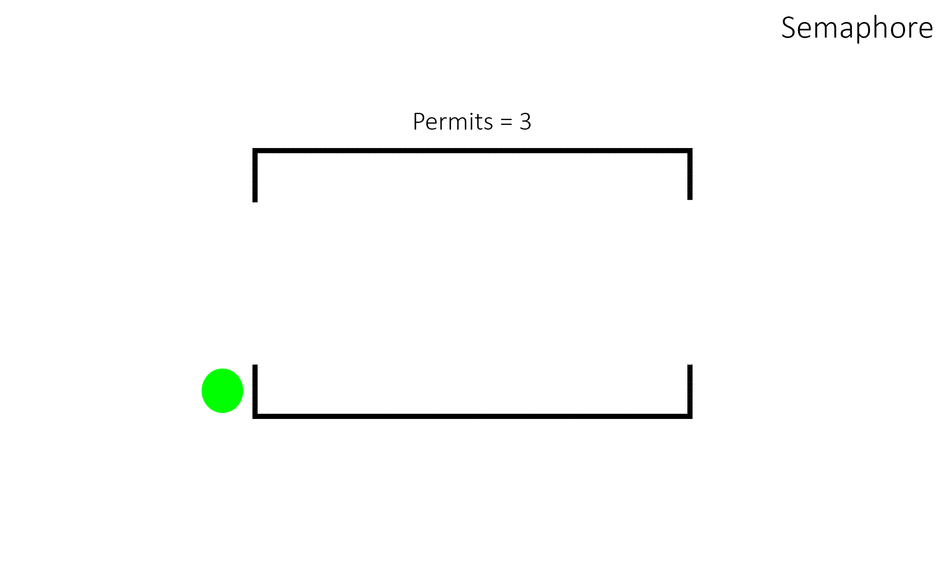

### [Semaphore](https://uk.wikipedia.org/wiki/%D0%A1%D0%B5%D0%BC%D0%B0%D1%84%D0%BE%D1%80_(%D0%BF%D1%80%D0%BE%D0%B3%D1%80%D0%B0%D0%BC%D1%83%D0%B2%D0%B0%D0%BD%D0%BD%D1%8F))
- [ docs.oracle.com ](https://docs.oracle.com/en/java/javase/20/docs/api/java.base/java/util/concurrent/Semaphore.html)

- [ ] Конструктор класу `Semaphore(int permits)` або `Semaphore(int permits, boolean fair)` обов'язково передається кількість потоків, якому семафор буде дозволяти одночасно використовувати заданий ресурс.

  

-[ ] Другий конструктор містить булеве значення `fair`(справедливий) `true` - забезпечує справедливий порядок, `false` - порядок не буде гарантуватися.
- `Справедливість != Продуктивність`: Справедливий семафор може бути менш продуктивним, ніж несправедливий через додаткові витрати на підтримку порядку черги. Якщо порядок доступу не є критичним, краще використовувати несправедливий семафор для кращої продуктивності.

- `Не гарантується абсолютна справедливість`: Хоча семафор із параметром fair встановленим у true намагається забезпечити доступ у порядку запиту, можуть виникнути випадки, коли цей порядок порушується через те, як планувальник потоків та JVM керують потоками.
- `за замовчуванням`: false.
