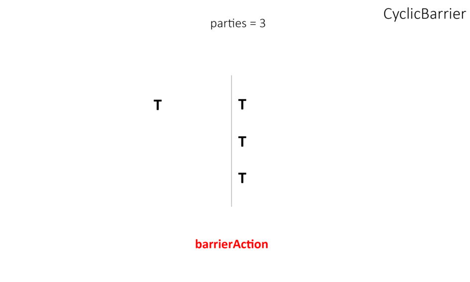

# CyclicBarrier 
- [ docs.oracle.com ](https://docs.oracle.com/en/java/javase/20/docs/api/java.base/java/util/concurrent/CyclicBarrier.html)

- [ ] CyclicBarrier - це клас у Java, який дозволяє групі потоків чекати один на одного до тих пір, поки не досягнуто певної "бар'єрної" точки. Коли останній потік досягає бар'єра, вони всі можуть продовжувати роботу.

  

- [ ]  Основні особливості:
-  Ініціалізація: CyclicBarrier ініціалізується певним значенням, яке вказує, скільки потоків має досягти бар'єра, перш ніж вони продовжать роботу.
-  Бар'єрна дія: Можна вказати опціональний потік, який запуститься, коли всі потоки досягнуть бар'єра.
-  Відновлення: Після того, як всі потоки досягли бар'єра, він автоматично "відновлюється", тобто готовий до наступного кола використання.
-  Гнучкість: Якщо деякі потоки не можуть досягти бар'єра (через помилку, наприклад), інші можуть "зламати" бар'єр викликом методу reset().